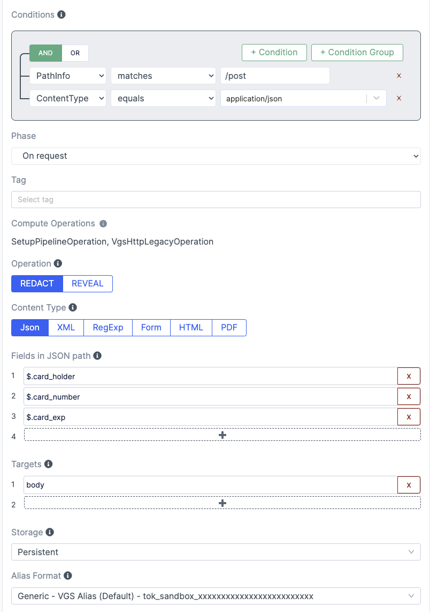
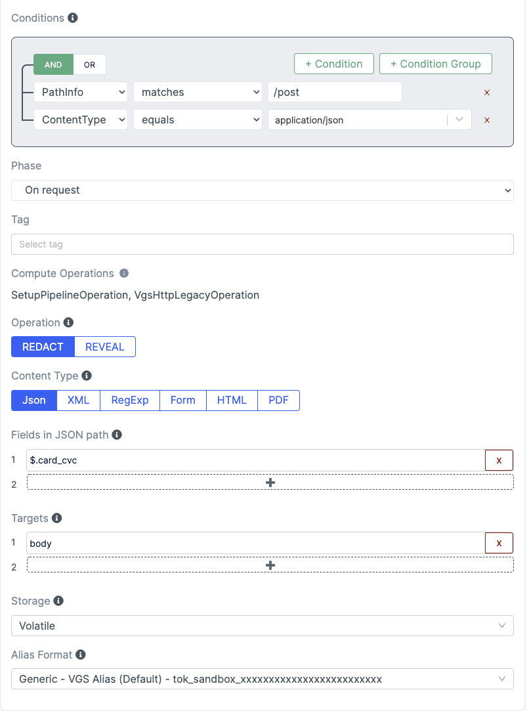
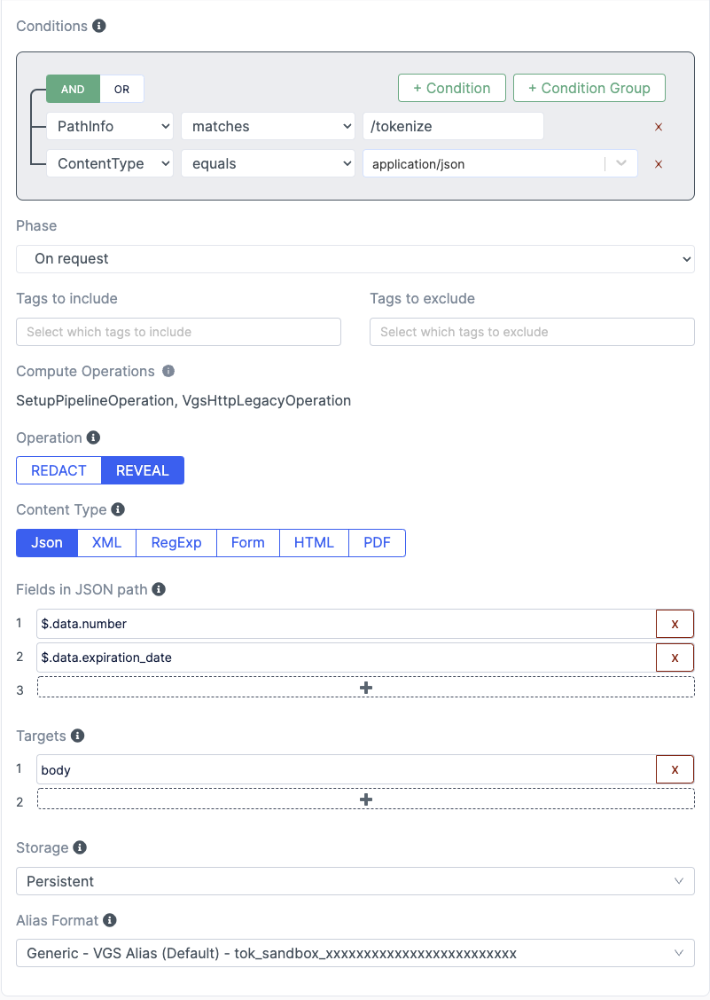
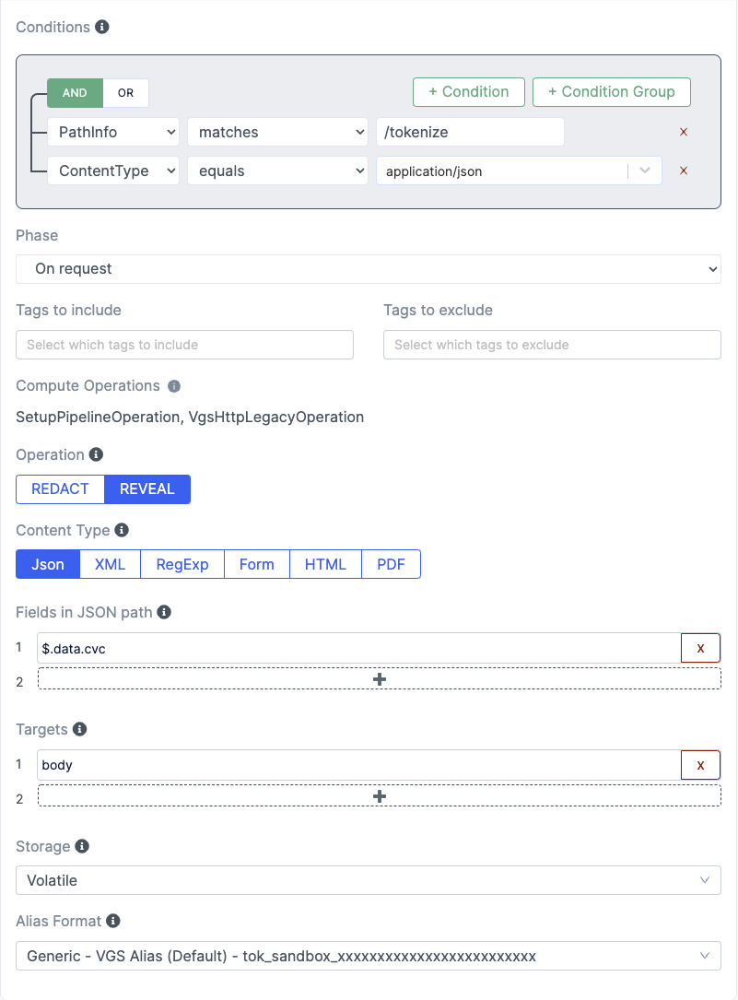

# Migration App

This application is meant to demonstrate how to migrate data from one vault provider to Basis Theory.

## Setup Very Good Security Vault

### Create Inbound Route
1. Set upstream host to `echo.apps.verygood.systems`
2. Add filter for `/post` path with `$.card_holder`, `$.card_number`, and `$.card_exp` as `REDACT` and `PERSISTENT` storage.

3. Add filter for `/post` path with `$.card_cvc` as `REDACT` and `VOLATILE` storage.


### Create Outbound Route
1. Set upstream host to `api\.basistheory\.com`
2. Add filter for `/tokenize` path with `$.data.number` and `$.data.expiration_date` as `REVEAL` and `PERSISTENT` storage.

3. Add filter for `/tokenize` path with `$.data.cvc` as `REVEAL` and `VOLATILE` storage.


## Create Environment variables

Create a `.env.local` with your secrets

```
BASIS_THEORY_SERVER_APPLICATION=
NEXT_PUBLIC_VGS_VAULT_ID=
VGS_USERNAME=
VGS_PASSWORD=
NODE_TLS_REJECT_UNAUTHORIZED=0
```

`NODE_TLS_REJECT_UNAUTHORIZED` is set to `0` to reject self-signed SSL certificates from VGS. This can be removed, but the Sandbox and CA certificates need to be configured in the `proxy.js` API class.

## Running

Run the development server:

```bash
npm run dev
# or
yarn dev
```